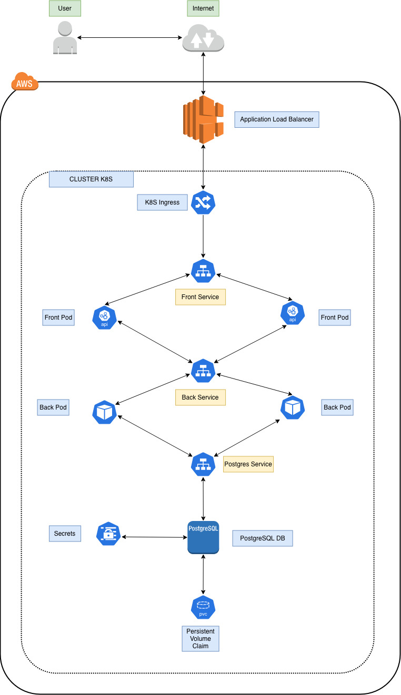
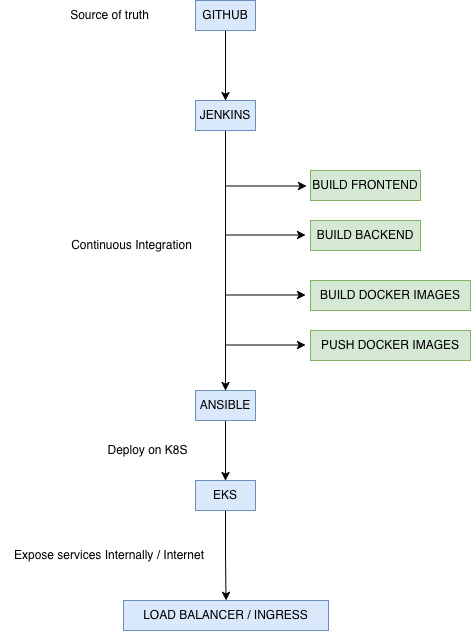
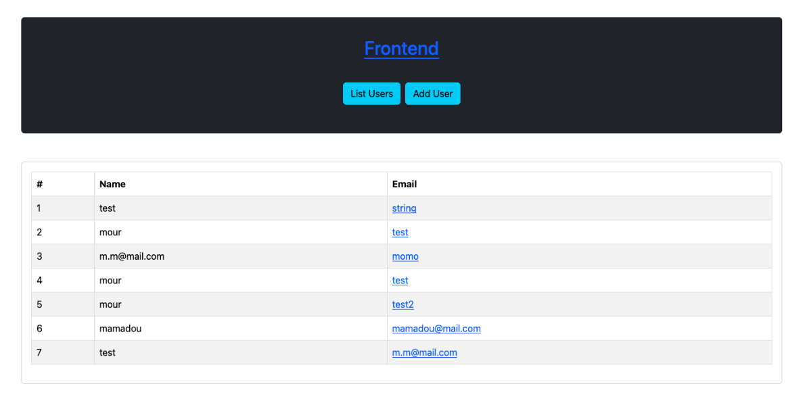
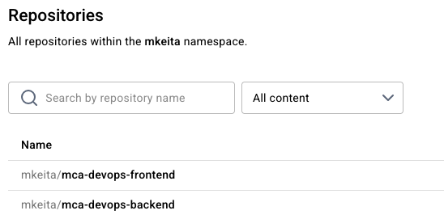
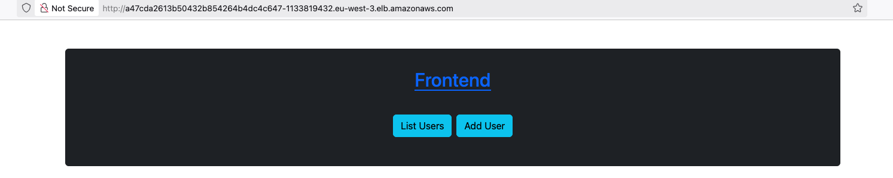
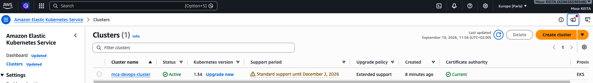

# mca-devops

**1. INTRODUCTION**
---
This project is about deploying a 3-components applicaiton :

- frontend : a Node application to interect with the backend insert and list users
- backend : Java/Maven app with REST API
- database : Postgres database

My target architecture is :



I choosed to deploy the solution on AWS using EKS (Elastic Kubernetes Service)
For docker image registry, i use : https://hub.docker.com.

The CI/CD workflow is like this  :




**2. PREREQUISITES**
---
Jenkins must have these tools installed :

docker
aws
kubectl
eksctl
ansible
node
npm
java
mvn

Ansible requires the Kubernetes collection and Python dependencies:

ansible-galaxy collection install kubernetes.core

```bash
pip install kubernetes boto3 botocore
```
<br>

AWS credentials must also be available to Jenkins.
<br>

Docker Hub credentials should be stored in Jenkins Credentials rather
<br>

**3. BUILD steps**
---
I build all the components locally before depolying. The Front and the back as well.

Frontend : 
<br>
```bash
npm install; ng build
```
Backend : 
<br>
```bash
mvn clean package
```
<br>
To build and push the docker images :
mkeita/mca-devops-frontend : 
<br>
```bash
docker build -t mketia/mca-devops-frontend .
```
<br>
mkeita/mca-devops-backend : 
```bash
docker build -t mkeita/mca-devops-backend .
```
<br>
To push on Docker hub repos :
```bash
docker push mkeita/mca-devops-frontend:1.0.0
docker push mkeita/mca-devops-backend:1.0.0
```

**4. DEPLOYMENT steps**
---
4.1. EKS
I choosed to deploy a EKS cluster with 2 nodes on eu-west-3 (Paris) that should be enough.
Added a namespace mca and EBS CSI driver on kube-system namespace.


**5. ANSIBLE**
---   
I decided to deploy on EKS as well.
<br>
For the inventory  Kubernetes communicates with nodes so need to fill the inventory.
<br>
For the versionning, i increment with the number of build : 1.0.1, 1.0.2 ...

mkeiita/mca-devops-frontend:1.0.2 ...


**6. JENKINS**
---
for the Jenkins pipeline, i first store the docker huhb credentials  on Jenkins Credentials, the AWS AK SK ...
and all the env vars. 
<br>
And i don't recreate EKS cluster for each deployment.


**7. REPOSITORY**
---
For deployments purposes, i separate Jenkins and ANsible.
<br>
I choose to have the same manifests files both in Ansible folder in k8s folder for the 2 types of deployment.
With Ansible or just Jenkins on my cluster mca-devops-cluster.


**8. DECISIONS and ISSUES**
---
I decided to deploy everything on AWS.
<br>
I also added some firewall rules to let internet connect to the frontend port  on Security Groups.
<br>
I decided to use one ALB.
<br>
I decided to use PVC to persist the data from Postgres pods.
<br>
I also added credentials on EKS secrets to not let it unencrypted. As a a guy with security background.
<br>

I faced somes issues : 
<br>
when deploying the Frontend on Dockerfile  when copying /app/dist --> /usr/share/...html : i had to find the real path 

<br>
i faced also issue when creating the PVC. I had to add OCI driver on the kube-system node.
<br>
And many other small issues for installing tools or pods to start...


**9. SCREENSHOTS**
--- 

9.1. Frontend with data
   


9.2. Docker hub
---   


9.3. ALB distrubuting Frontend on AWS
---   


9.4. Cluster AWS
---


